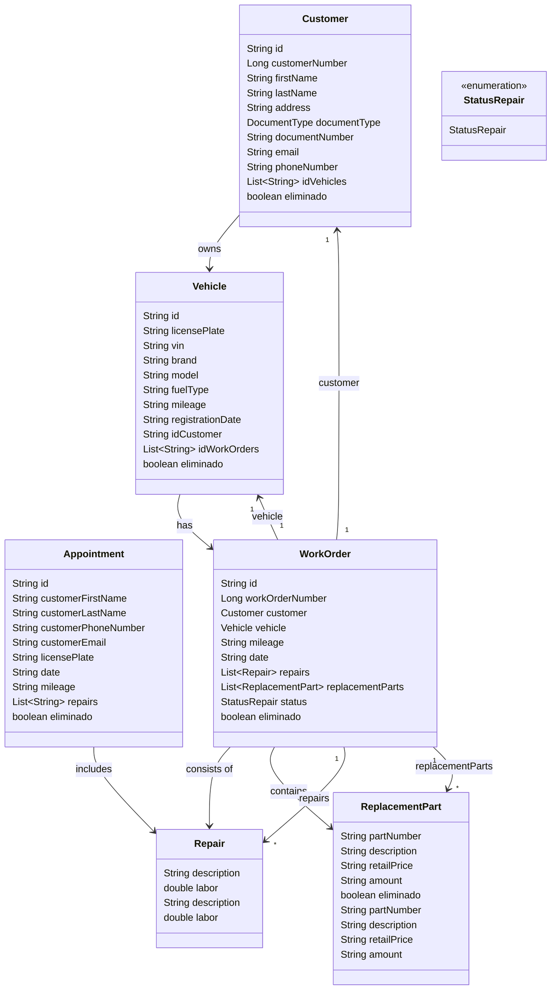
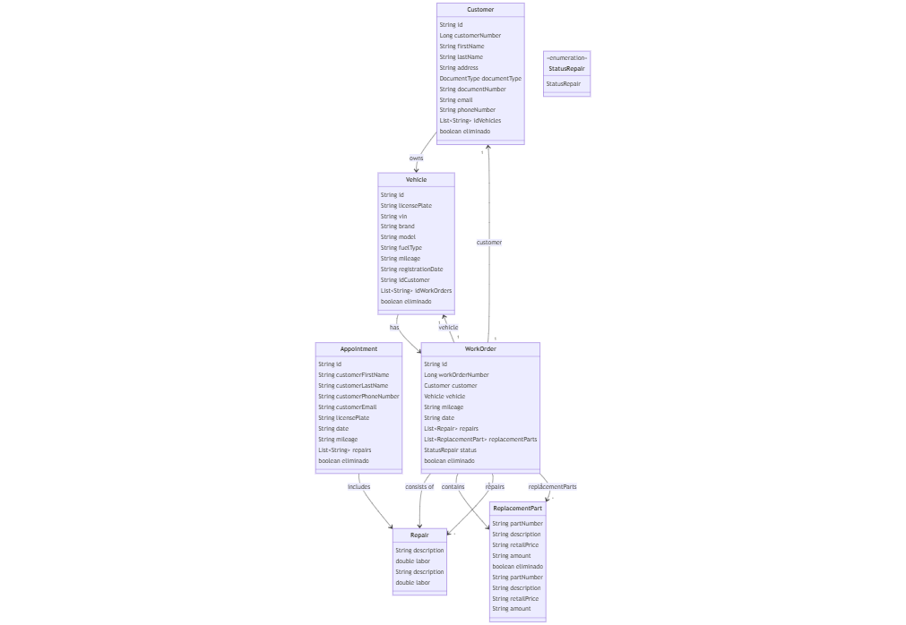

# Proyecto Mechanical-workshop

## Descripción

Proyecto Mechanical-workshop, este proyecto es un sistema de gestión para un taller de reparación de vehículos. Permite gestionar clientes, vehículos, órdenes de trabajo, reparaciones y recambios de una manera eficiente y organizada.

## Arquitectura

Para los microservicios estamos usando una Arquitectrura Hexagonal.
Consta de 3 capas principales:

- **Dominio**
  Esta capa contiene los Servicios y el Modelo de Negocio, y cualquier cosa relacionada con el solamente.
  En los arquetipos actuales solo usamos el Modeo Anémico (Anemic Model), si queremos usar el Modelo Enriquecido (Rich Model) esta capa contendra los puertos de salida, del repositorio y de los eventos kafka, y no la capa Aplicación.

- **Aplicación**
  Esta capa contiene los puertos de comunicación con la capa Infrestructura, no es necesario un puerto de entrada, ya que es redundante en Java llamar a una interfaz si no se va a usar para nada mas.
  Tambien contiene los servicios que realizaran los casos de uso, haciendo uso del domain como considere oportuno.
  Las clases de datos en esta capa no existen ya que son el Dominio.

- **Infraestructura**
  Esta capa contiene los Servicios de comunicación externa de nuestra aplicacion. Se divide a si misma en los paquetes necesarios para desacoplar cada entrada y salida posible, se pueden crear nuevos si es necesario pero se han predefinido estos para estas funcionalidades:
    - **ApiRest**
      Contiene los Controladores, Dtos, Seguridad y clases necesarias para la comunicacion por Api Rest
    - **IntegrationEvents**
      Contiene los Consumidores, Productores y clases necesarias para la comunicacion por Eventos
    - **Repository**
      Contiene los Repositorios, Dtos y clases necesarias para la persistencia de datos

## Diagrama de Clases

## Endpoints

#### Endpoints del Controlador de Clientes

- **POST /customers**
  Crea un nuevo cliente en el sistema.

- **GET /customers**
  Obtiene todos los clientes paginados.

- **GET /customers/{id-customer}**
  Obtiene un cliente específico por su ID.

- **GET /customers/search/{type-search}?value={value}**
  Busca clientes por un tipo específico de búsqueda. Donde 'type-search' es el tipo de búsqueda (por ejemplo, documentNumber, lastName, email, etc.) y 'value' es el valor a buscar 

- **PATCH /customers/{id-customer}**
  Actualiza parcialmente un cliente existente por su ID.

- **PUT /customers/{id-customer}**
  Reemplaza completamente un cliente existente por su ID.

- **DELETE /customers/{id-customer}**
  Elimina un cliente específico por su ID.

#### Endpoints del Controlador de Vehículos

- **POST /vehicles**
  Crea un nuevo vehículo en el sistema.

- **GET /vehicles**
  Obtiene todos los vehículos paginados.

- **GET /vehicles/{id-vehicle}**
  Obtiene un vehículo específico por su ID.

- **GET /vehicles/search/{type-search}?value={value}**
  Busca vehículos por un tipo específico de búsqueda. Donde 'type-search' es el tipo de búsqueda (por ejemplo, licensePlate, vin) y 'value' es el valor a buscar 

- **PATCH /vehicles/{id-vehicle}**
  Actualiza parcialmente un vehículo existente por su ID.

- **PUT /vehicles/{id-vehicle}**
  Reemplaza completamente un vehículo existente por su ID.

- **DELETE /vehicles/{id-vehicle}**
  Elimina un vehículo específico por su ID.

#### Endpoints del Controlador de Órdenes de trabajo

- **POST /workorders**
  Crea una nueva orden de trabajo en el sistema.

- **GET /workorders**
  Obtiene todas las ordenes de trabajo paginados.

- **GET /workorders/{id-workOrder}**
  Obtiene una orden de trabajo específica por su ID.

- **GET /workorders/search/{type-search}?value={value}**
  Busca ordenes de trabajo por un tipo específico de búsqueda. Donde 'type-search' es el tipo de búsqueda (por ejemplo, orderNumber, licensePlate) y 'value' es el valor a buscar 

- **PATCH /workorders/{id-workOrder}**
  Actualiza parcialmente una orden de trabajo existente por su ID.

- **PUT /workorders/{id-workOrder}**
  Reemplaza completamente una orden de trabajo existente por su ID.

- **DELETE /workorders/{id-workOrder}**
  Elimina una orden de trabajo específica por su ID.

#### Endpoints del Controlador de Citas

- **POST /appointments**
  Crea una nueva cita en el sistema.

- **GET /appointments**
  Obtiene todos las citas paginados.

- **GET /appointments/{id-appointment}**
  Obtiene una cita específica por su ID.

- **GET /appointments/search/{type-search}?value={value}**
  Busca citas por un tipo específico de búsqueda. Donde 'type-search' es el tipo de búsqueda (por ejemplo, customerEmail, customerPhoneNumber, date) y 'value' es el valor a buscar 

- **PATCH /appointments/{id-appointment}**
  Actualiza parcialmente una cita existente por su ID.

- **PUT /appointments/{id-appointment}**
  Reemplaza completamente una cita existente por su ID.

- **DELETE /appointments/{id-appointment}**
  Elimina una cita específica por su ID.

## Swagger

No se necesita de ninguna configuracion adicional para configurar Swagger.

El endpoint que se genera para poder visualizar el Api es:
- /swagger-ui/index.html

El Json con la descripcion:
- /v3/api-docs

Para desactivar estas URL en entornos productivos hay que poner estas propiedades:
- springdoc.api-docs.enabled: false
- springdoc.swagger-ui.enabled: false

## Contribuye

Para cualquier pregunta o consulta, por favor contacta a pacomontaner22@gmail.com.
